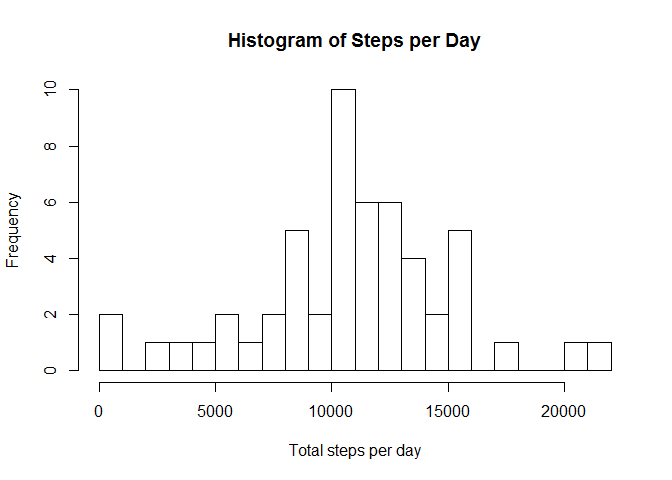
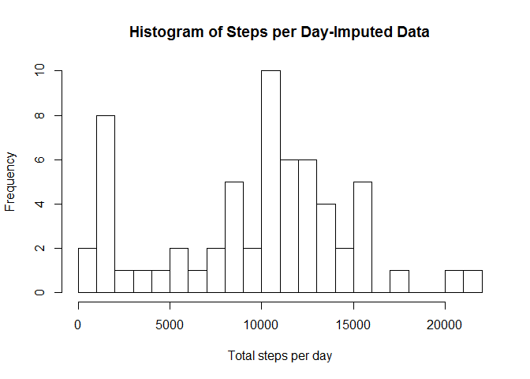
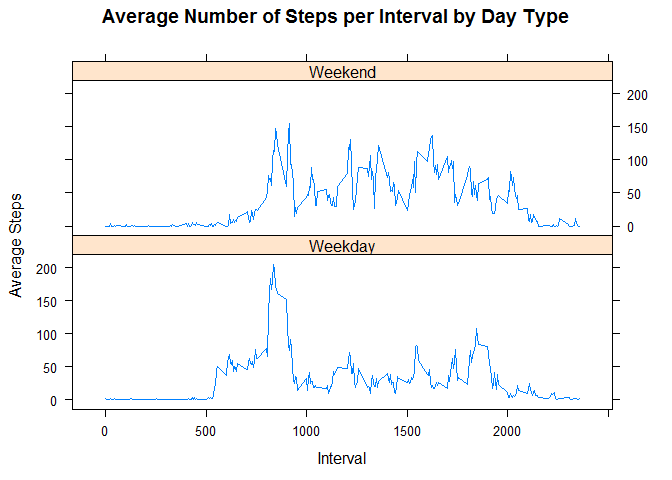

## Preliminaries
This R markdown file assumes that the activity.csv file is in the working directory. If necessary download the activity.zip file from the github repo, extract the activity.csv file from it and copy it into the working directory.

## load needed packages

```r
library(tidyverse)
```

```
## -- Attaching packages ---------------------------------- tidyverse 1.2.1 --
```

```
## v ggplot2 2.2.1     v purrr   0.2.4
## v tibble  1.4.1     v dplyr   0.7.4
## v tidyr   0.7.2     v stringr 1.2.0
## v readr   1.1.1     v forcats 0.2.0
```

```
## -- Conflicts ------------------------------------- tidyverse_conflicts() --
## x dplyr::filter() masks stats::filter()
## x dplyr::lag()    masks stats::lag()
```

```r
library(lattice)
```

## Loading and preprocessing the data

```r
activity<-as.tibble(read.csv("activity.csv"))
```


## What is mean total number of steps taken per day?
### Calculate the total number of steps taken per day.

```r
StepsPerDay<-activity%>%group_by(date)%>%summarise(TotalSteps=sum(steps))
```

### Make a histogram of the total steps per day

```r
hist(StepsPerDay$TotalSteps,breaks=25,main="Histogram of Steps per Day",xlab="Total steps per day")
```

<!-- -->

### Calculate and report the mean and the median of the total number of steps per day.

```r
meansteps<- format(mean(StepsPerDay$TotalSteps,na.rm=TRUE),digits=7,decimal.mark=".", big.mark = ",", small.interval = 3)
mediansteps<-format(median(StepsPerDay$TotalSteps,na.rm=TRUE),digits=7,decimal.mark=".", big.mark = ",", small.interval = 3)
```
The mean number of steps per day is 10,766.19.  
The median number of steps per day is 10,765.

## What is the average daily activity pattern?
### Make a time series plot of the average number of steps per interval across all days.

```r
AvgStepsPerInterval<-activity%>%group_by(interval)%>%summarise(AvgSteps=mean(steps,na.rm=TRUE))
with(AvgStepsPerInterval,plot(x=interval,y=AvgSteps,type="l",main="Average Steps per Interval",xlab="Interval",ylab="Average Steps"))
```

<!-- -->

### Which 5 minute interval, on average, contains the maximum number of steps.

```r
maxinterval<-AvgStepsPerInterval$interval[which.max(AvgStepsPerInterval$AvgSteps)]
```
The interval with the maximum number of average steps across all days is interval 835.  

## Imputing missing values
### Calculate and report the number of rows with missing values.

```r
num_missing<-format(sum(is.na(activity$steps)),digits=7,decimal.mark=".", big.mark = ",", small.interval = 3)
```
The number of missing values is 2,304.  

### Devise a strategy for filling in missing values
My strategy is to use the median for the interval.

### Create a new dataset like the orginal one but with the missing values filled in.

```r
MedianStepsPerInterval<-activity%>%group_by(interval)%>%summarise(MedianSteps=median(steps,na.rm=TRUE))
 mergedTable<-left_join(activity,MedianStepsPerInterval,by="interval")
 mergedTable$steps<-with(mergedTable,ifelse(is.na(steps),MedianSteps,steps))
 activityImputed<-mergedTable%>%select(-MedianSteps)
```
### Make a histogram of the total number of steps per day with the imputed data

```r
StepsPerDayImputed<-activityImputed%>%group_by(date)%>%summarise(TotalSteps=sum(steps))
hist(StepsPerDayImputed$TotalSteps,breaks=25,main="Histogram of Steps per Day-Imputed Data",xlab="Total steps per day")
```

<!-- -->

### Calculate and report the mean and median total number of steps taken per day. Do these values differ from the estimates from the first part of the assignment? What is the impact of imputing missing data on the estimates of the total daily number of steps?

```r
meanstepsImputed<- format(mean(StepsPerDayImputed$TotalSteps,na.rm=TRUE),digits=7,decimal.mark=".", big.mark = ",", small.interval = 3)
medianstepsImputed<-format(median(StepsPerDayImputed$TotalSteps,na.rm=TRUE),digits=7,decimal.mark=".", big.mark = ",", small.interval = 3)
```
The mean number of steps per day is 9,503.869. This is lower than the original estimate.  
The median number of steps per day is 10,395. This is lower than the original estimate. 
Imputing the data adds 8 days to the 1000-2000 break in the histogram.


## Are there differences in activity patterns between weekdays and weekends?
### Create a new factor variable which indicates weekday or weekend

```r
activityImputed$daytype<-ifelse(weekdays(as.Date(activityImputed$date))%in%c("Saturday","Sunday"),"Weekend","Weekday")
```

### Make a panel plot of average number of steps taken per interval split by weekday and weekend.

```r
dataForGraph<-activityImputed%>%group_by(daytype,interval)%>%summarise(avgSteps=mean(steps,na.rm=TRUE))
 xyplot(avgSteps~interval|daytype,data=dataForGraph,type="l",layout=c(1,2),main="Average Number of Steps per Interval by Day Type",ylab="Average Steps",xlab="Interval")
```

<!-- -->
